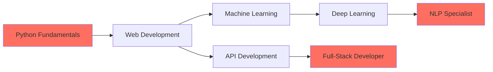

<h1 align="center">
  
</h1>

<p align="center">
  
</p>

<p align="center">
  
</p>

<p align="center">
  
  
  
  
</p>

<div align="center">
  
</div>

---

## 🚀 About Me


```python
class OmkarMahanandia:
    def __init__(self):
        self.role = "Full-Stack Python Developer"
        self.education = "Master's in Computer Applications (MCA)"
        self.interests = [
            "Machine Learning", 
            "NLP", 
            "AI Systems", 
            "Indian Language Tech"
        ]
        self.current_focus = [
            "NLP", 
            "OCR", 
            "ML-powered Full-Stack Apps"
        ]
        self.location = "India 🇮🇳"
        self.passion = "Building impactful solutions"
        
    def say_hi(self):
        print("Thanks for dropping by! Let's build something amazing together! 🚀")

me = OmkarMahanandia()
me.say_hi()
```

<br clear="right"/>

- 🎓 **Master's student** in Computer Applications (MCA)
- 🧠 Deep interest in **Machine Learning, NLP, and AI-driven systems**
- 💻 Build **end-to-end applications** combining Frontend + Backend + ML models
- 🌍 Passionate about **Indian language technology** and accessibility
- 🔭 Currently working on **NLP, OCR, and ML-powered full-stack projects**
- 🛠 Love solving problems at the intersection of **code + data + users**
- 💬 Ask me about **Python, ML, NLP, Flask, APIs, Databases**
- 📫 Reach me at: **omkarmahanandia@gmail.com**
- ⚡ **Fun fact:** I believe the best code tells a story!

<div align="center">
  
</div>

---

## 💼 Technical Arsenal


<table>
<tr>
<td width="50%" valign="top">

### 🎨 Frontend
```javascript
const frontend = {
  languages: ["HTML", "CSS", "JavaScript"],
  focus: ["Responsive Design", "API Integration"],
  tools: ["Bootstrap", "Modern CSS"],
  learning: ["React", "Vue.js"]
}
```

<p align="center">
  
</p>

### ⚙️ Backend
```python
backend = {
    "languages": ["Python"],
    "frameworks": ["Flask", "Django"],
    "expertise": ["REST APIs", "Authentication", "CRUD Systems"],
    "tools": ["SQLAlchemy", "JWT", "WebSockets"]
}
```

<p align="center">
  
</p>

</td>
<td width="50%" valign="top">

### 🤖 Machine Learning & NLP
- 🎯 **Supervised & Unsupervised Learning**
- 📝 **Text Processing & Cleaning**
- 🔤 **TF-IDF & Word Embeddings**
- 😊 **Sentiment Analysis**
- 📊 **Text Classification**
- 🔄 **Seq2Seq Models (Encoder-Decoder)**
- 🌐 **Machine Translation**
- 👁️ **OCR & Language Models**

<p align="center">
  
</p>

### 🗄️ Databases
<p align="center">
  
</p>

- **MySQL** | **PostgreSQL** | **MongoDB**
- Database Design & Optimization
- Query Optimization & Indexing

</td>
</tr>
</table>


### 🛠️ Tools & Platforms

<p align="center">
  
</p>

<p align="center">
  
  
  
  
  
  
  
</p>

<div align="center">
  
</div>

---

## 🌟 Featured Projects

<div align="center">
  
</div>

<table>
<tr>
<td width="50%" valign="top">

### 🎬 IMDB Sentiment Analysis


**Tech Stack:** ML + Flask + Frontend

- ✅ Real-time sentiment prediction
- ✅ Interactive web interface
- ✅ Trained on large IMDB dataset
- ✅ RESTful API backend
- ✅ Model accuracy: 85%+

<p align="center">
  
  
  
</p>

</td>
<td width="50%" valign="top">

### 🈶 English → Hindi Translation


**Tech Stack:** Seq2Seq LSTM + Python

- 🔥 Neural machine translation
- 🔥 Encoder-Decoder architecture
- 🔥 Attention mechanism
- 🔥 Context-aware translations
- 🔥 BLEU score optimization

<p align="center">
  
  
  
</p>

</td>
</tr>
<tr>
<td width="50%" valign="top">

### 💼 HR Management System


**Tech Stack:** Flask + MySQL + Frontend

- 💡 Complete employee lifecycle management
- 💡 Attendance tracking & leave management
- 💡 Role-based access control
- 💡 Report generation & analytics
- 💡 Authentication system
- 💡 Dashboard with real-time stats

<p align="center">
  
  
  
</p>

</td>
<td width="50%" valign="top">

### 🚀 More Projects Coming Soon!


**Currently Building:**

- 🔨 Advanced OCR System
- 🔨 Multilingual Chatbot
- 🔨 Predictive Analytics Dashboard
- 🔨 AI-powered Code Assistant

<p align="center">
  
</p>

**Stay Tuned!** 🎯

</td>
</tr>
</table>

<div align="center">
  
</div>

---

## 📊 GitHub Stats

<p align="center">
  
</p>

<div align="center">
  
</div>

---

## 🔗 Connect With Me

<div align="center">
  
</div>

<br>

<p align="center">
  <a href="https://www.linkedin.com/in/omkarmahanandia">
    
  </a>
  <a href="https://github.com/Omkarmahanandia36">
    
  </a>
  <a href="mailto:omkarmahanandia@gmail.com">
    
  </a>
  <a href="https://twitter.com/omkarmahanandia">
    
  </a>
</p>

<p align="center">
  
</p>

<div align="center">
  
### 💬 Let's Build Something Amazing Together!

**Open to:**
- 🤝 Collaboration on ML/NLP projects
- 💼 Freelance opportunities
- 🎓 Knowledge sharing & mentoring
- 🚀 Full-time positions

</div>

<div align="center">
  
</div>

---

## 🧰 Complete Tech Stack

<p align="center">
  
  
  
  
</p>

<p align="center">
  
  
  
  
</p>

<p align="center">
  
  
  
  
</p>

<p align="center">
  
  
  
  
</p>

<p align="center">
  
  
  
  
</p>

<div align="center">
  
</div>

---

## 🎯 Current Focus Areas

<table align="center">
<tr>
<td align="center" width="25%">

<br><strong>Machine Learning</strong>
<br><sub>Building intelligent systems</sub>
</td>
<td align="center" width="25%">

<br><strong>Full-Stack Development</strong>
<br><sub>End-to-end solutions</sub>
</td>
<td align="center" width="25%">

<br><strong>NLP & OCR</strong>
<br><sub>Language understanding</sub>
</td>
<td align="center" width="25%">

<br><strong>API Development</strong>
<br><sub>Scalable backends</sub>
</td>
</tr>
</table>

<div align="center">
  
</div>

---

## 📈 Contribution Graph

<p align="center">
  
</p>

<div align="center">
  
</div>

---

## 🎓 Learning Journey

<div align="center">



</div>

<div align="center">
  
</div>

---

<p align="center">
  
</p>

<p align="center">
  
</p>

<div align="center">
  
### 🌟 "Code is poetry, data is art, and AI is the future" 🌟

</div>

<p align="center">
  
</p>
