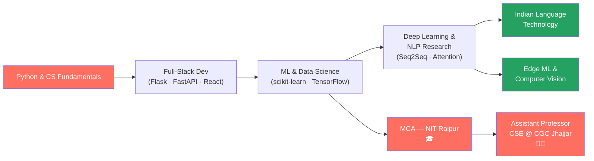

<h1 align="center">
  
</h1>

<p align="center">
  
</p>

<p align="center">
  
  
  
  
  
</p>

<div align="center">
  
</div>

---

## 🧑‍💻 About Me


```python
class OmkarMahanandia:
    def __init__(self):
        self.name       = "Omkar Mahanandia"
        self.role       = "Assistant Professor, CSE — CGC Jhajjar"
        self.education  = "MCA — NIT Raipur"
        self.core       = ["Machine Learning", "Data Science", "NLP"]
        self.teaches    = ["OOP with Java", "System Design"]
        self.stack      = ["Python", "FastAPI", "React", "PostgreSQL"]
        self.research   = ["Indian Language Tech", "Edge ML", "OCR"]
        self.building   = "Cyber Sahayak — AI Cybercrime Reporting Assistant"
        self.location   = "India 🇮🇳"

    def philosophy(self):
        return "Teach deeply. Build deliberately. Impact meaningfully."

me = OmkarMahanandia()
print(me.philosophy())
# → "Teach deeply. Build deliberately. Impact meaningfully."
```

<br clear="right"/>

- 🎓 **MCA from NIT Raipur** — National Institute of Technology, one of India's premier institutes
- 👨‍🏫 **Assistant Professor, CSE** at **CGC Jhajjar** — teaching OOP with Java & System Design
- 🤖 Deep expertise in **Machine Learning, Data Science, and NLP**
- 🌏 Passionate about **Indian language technology** — working in Odia, Hindi, Bengali
- 🔬 Research interests: **Edge ML, Seq2Seq models, OCR for low-resource languages**
- 🛡️ Building **Cyber Sahayak** — AI-powered cybercrime reporting platform for India
- 💬 Ask me about **Python · ML pipelines · NLP · System Design · Full-Stack APIs**
- 📫 Reach me at: **omkarmahanandia@gmail.com**
- ⚡ _"The best model is the one that solves a real problem for a real person."_

<div align="center">
  
</div>

---

## 🎓 Education & Credentials

<div align="center">

| 🏛️ Institution | 📜 Degree | 🗓️ Year |
|:---|:---|:---|
| **National Institute of Technology, Raipur** | Master of Computer Applications (MCA) | 2023 |
| Chandigarh Group of Colleges, Jhajjar (CGC) | Assistant Professor — CSE Department | 2024–Present |

</div>

> 💡 MCA from **NIT Raipur** — one of India's top NITs, with specialization in ML, NLP, and Full-Stack Development.

<div align="center">
  
</div>

---

## 💼 Technical Arsenal

<table>
<tr>
<td width="50%" valign="top">

### 🤖 Machine Learning & Data Science
```python
ml_stack = {
    "frameworks":  ["scikit-learn", "TensorFlow", "PyTorch", "Keras"],
    "nlp":         ["HuggingFace", "NLTK", "spaCy", "Seq2Seq LSTM"],
    "data":        ["Pandas", "NumPy", "Matplotlib", "Seaborn"],
    "techniques":  [
        "Supervised & Unsupervised Learning",
        "Neural Machine Translation",
        "Text Classification & Sentiment Analysis",
        "Encoder-Decoder with Attention",
        "OCR & Document Intelligence",
        "Edge-ML & Computer Vision"
    ]
}
```
<p align="center">
  
</p>

</td>
<td width="50%" valign="top">

### ⚙️ Backend & APIs
```python
backend = {
    "languages":   ["Python"],
    "frameworks":  ["FastAPI", "Flask", "Django"],
    "expertise":   [
        "REST API Design",
        "JWT Authentication",
        "WebSockets",
        "Async Backends"
    ],
    "deployment":  ["Railway", "Docker", "Linux"]
}
```
<p align="center">
  
</p>

</td>
</tr>
<tr>
<td width="50%" valign="top">

### 🎨 Frontend
```javascript
const frontend = {
  frameworks: ["React", "React Native"],
  languages:  ["JavaScript", "HTML5", "CSS3"],
  ui:         ["Bootstrap", "Tailwind CSS"],
  tools:      ["Axios", "REST integration"]
}
```
<p align="center">
  
</p>

</td>
<td width="50%" valign="top">

### 🗄️ Databases & DevOps
```python
infra = {
    "databases": ["PostgreSQL", "MySQL", "MongoDB", "SQLite"],
    "devops":    ["Docker", "Railway", "Git", "Linux"],
    "tools":     ["Postman", "Jupyter", "VS Code", "Ollama"]
}
```
<p align="center">
  
</p>

</td>
</tr>
</table>

<div align="center">
  
</div>

---

## 🌟 Featured Projects

<table>
<tr>
<td width="50%" valign="top">

### 🛡️ Cyber Sahayak
> AI-powered cybercrime reporting assistant for India

**Stack:** FastAPI · React · React Native · PostgreSQL · Ollama

- 🔍 Vernacular NLP — supports Odia, Hindi, English
- 📋 Automated FIR drafting from incident descriptions
- 🤖 Local LLM (Ollama) for privacy-first processing
- 🌐 Citizen-facing mobile + web interface
- 📊 Analytics dashboard for law enforcement
- 🎯 Targeted for Odisha government licensing

<p align="center">
  
  
  
</p>

</td>
<td width="50%" valign="top">

### 🈶 English → Hindi Neural Translation
> Seq2Seq machine translation system

**Stack:** TensorFlow · Keras · Python · LSTM

- 🧠 Encoder-Decoder with Attention mechanism
- 📈 BLEU score optimized for Indian language pairs
- 🔤 Context-aware translations
- 🌐 Trained on parallel English-Hindi corpora
- 📦 Production-ready inference pipeline

<p align="center">
  
  
  
</p>

</td>
</tr>
<tr>
<td width="50%" valign="top">

### 🎬 IMDB Sentiment Analysis
> End-to-end ML web application

**Stack:** Python · Flask · scikit-learn · HTML/CSS/JS

- ✅ Real-time sentiment prediction via REST API
- ✅ TF-IDF + classical ML baseline + Deep Learning
- ✅ Interactive web interface
- ✅ **85%+ accuracy** on IMDB test set
- ✅ Modular, production-grade codebase

<p align="center">
  
  
  
</p>

</td>
<td width="50%" valign="top">

### 💼 HR Management System
> Multi-role enterprise system — deployed on Railway

**Stack:** Flask · SQLite (WAL) · JWT · Railway

- 👥 Full employee lifecycle management
- 🔐 Multi-admin role-based access control
- 📊 Attendance, leave, and analytics dashboard
- 🚀 Deployed live on Railway with env config
- ⚡ SQLite with WAL mode for concurrency

<p align="center">
  
  
  
</p>

</td>
</tr>
</table>

<div align="center">
  
</div>

---

## 👨‍🏫 Teaching & Research

<table align="center">
<tr>
<td align="center" width="33%">
<strong>📘 OOP with Java</strong><br/>
<sub>Assistant Professor, CGC Jhajjar<br/>Inheritance, Polymorphism,<br/>Design Patterns, Collections</sub>
</td>
<td align="center" width="33%">
<strong>🏗️ System Design</strong><br/>
<sub>Assistant Professor, CGC Jhajjar<br/>HLD/LLD, Scalability,<br/>Distributed Systems, Caching</sub>
</td>
<td align="center" width="33%">
<strong>🔬 Research Areas</strong><br/>
<sub>Indian Language NLP<br/>Edge ML · OCR<br/>Low-resource Language Tech</sub>
</td>
</tr>
</table>

> 🎯 **Teaching Philosophy:** I bridge theory and practice — every concept taught in the classroom is grounded in real-world systems and hands-on projects.

<div align="center">
  
</div>

---

## 📈 GitHub Stats

<p align="center">
  
  
</p>

<p align="center">
  
</p>

<p align="center">
  
</p>

<div align="center">
  
</div>

---

## 🗺️ Learning Journey



<div align="center">
  
</div>

---

## 🔗 Connect With Me

<p align="center">
  <a href="https://www.linkedin.com/in/omkarmahanandia">
    
  </a>
  <a href="https://github.com/Omkarmahanandia36">
    
  </a>
  <a href="mailto:omkarmahanandia@gmail.com">
    
  </a>
</p>

<div align="center">

### 🤝 Open To

| 💼 Industry Roles | 🔬 Research Collabs | 🎓 Academic Opportunities | 🛠️ Open Source |
|:---|:---|:---|:---|
| ML / Data Science Engineer | NLP & Indian Language Tech | Visiting Faculty / Talks | ML & NLP Projects |
| Full-Stack Python Developer | Edge ML & CV Research | Guest Lectures / Workshops | AI for Social Good |

</div>

<div align="center">
  
</div>

---

<p align="center">
  
</p>

<p align="center">
  
</p>

<div align="center">

### 🌟 _"Teach what you build. Build what you teach."_ 🌟

</div>
