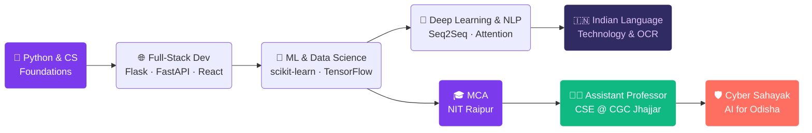

<div align="center">


</div>

<div align="center">

[](https://github.com/Omkarmahanandia36)

</div>

<div align="center">

[](https://github.com/Omkarmahanandia36)
[](https://github.com/Omkarmahanandia36)
[](https://linkedin.com/in/omkarmahanandia)

</div>

<br/>

---

<div align="center">

## ✦ &nbsp; WHO I AM &nbsp; ✦

</div>

<br/>

<table align="center" border="0" cellspacing="0" cellpadding="0">
<tr>
<td width="55%" valign="top">

```python
################################
#   omkar_mahanandia.profile   #
################################

class OmkarMahanandia:

    name        = "Omkar Mahanandia"
    title       = "Assistant Professor — CSE"
    institute   = "CGC Jhajjar, Haryana"
    education   = "MCA · NIT Raipur  🎓"

    teaches     = [
        "Object-Oriented Programming (Java)",
        "System Design"
    ]

    expertise   = [
        "Machine Learning & Data Science",
        "Natural Language Processing",
        "Indian Language Technology",
        "Full-Stack Python Development"
    ]

    currently   = "Building Cyber Sahayak 🛡️"
    languages   = ["Odia","Hindi","English"]
    motto       = "Teach deeply. Build deliberately."

```

</td>
<td width="5%"></td>
<td width="40%" valign="top" align="center">


<br/><br/>

📍 India &nbsp;|&nbsp; 📧 omkarmahanandia@gmail.com

<br/>

[](mailto:omkarmahanandia@gmail.com)

</td>
</tr>
</table>

<br/>

---

<div align="center">

## 🎓 &nbsp; EDUCATION & CREDENTIALS

</div>

<br/>

<div align="center">

<table>
<thead>
<tr>
<th align="center">🏛️ &nbsp; Institution</th>
<th align="center">📜 &nbsp; Qualification</th>
<th align="center">🏷️ &nbsp; Status</th>
</tr>
</thead>
<tbody>
<tr>
<td align="center"><b>National Institute of Technology, Raipur</b><br/><sub>One of India's premier NITs</sub></td>
<td align="center">Master of Computer Applications (MCA)<br/><sub>Specialization · ML · NLP · Full-Stack</sub></td>
<td align="center"></td>
</tr>
<tr>
<td align="center"><b>C.G.C Mohali</b><br/><sub>Chandigarh Group of Colleges</sub></td>
<td align="center">Assistant Professor — CSE Dept.<br/>
<td align="center"></td>
</tr>
</tbody>
</table>

</div>

<br/>

---

<div align="center">

## ⚡ &nbsp; TECHNICAL MASTERY

</div>

<br/>

<div align="center">

### 🤖 &nbsp; Machine Learning & Data Science &nbsp; 🤖


</div>

<br/>

<div align="center">

### 🌐 &nbsp; Backend · APIs · Databases


</div>

<br/>

<div align="center">

### 🎨 &nbsp; Frontend · DevOps · Tools


</div>

<br/>

---

<div align="center">

## 🚀 &nbsp; FEATURED PROJECTS

</div>

<br/>

<div align="center">

### ╔══════════════════════════════════════╗
### &nbsp;&nbsp;&nbsp;&nbsp;&nbsp;&nbsp; 🛡️ &nbsp; CYBER SAHAYAK &nbsp; — &nbsp; FLAGSHIP PROJECT
### ╚══════════════════════════════════════╝

</div>

<div align="center">

> *An AI-powered cybercrime reporting assistant built for India — vernacular NLP, automated FIR drafting, privacy-first local LLM.*


| Feature | Description |
|:---|:---|
| 🗣️ **Vernacular NLP** | Supports Odia, Hindi, and English citizen inputs |
| 📋 **Auto FIR Drafting** | AI generates structured complaint from narrative |
| 🔒 **Privacy-First** | Local LLM via Ollama — no data leaves the device |
| 📱 **Dual Interface** | Citizen mobile app + Law enforcement web dashboard |
| 🎯 **Gov-Ready** | Targeting Odisha state licensing & deployment |

</div>

<br/>

<div align="center">

<table border="0">
<tr>

<td width="50%" valign="top" align="center">

### 🈶 &nbsp; Neural Machine Translation

> English → Hindi via Seq2Seq + Attention


✦ Encoder-Decoder with Attention mechanism  
✦ BLEU score optimized for Indian language pairs  
✦ Trained on parallel English-Hindi corpora  
✦ Context-aware, production-ready inference  

</td>

<td width="50%" valign="top" align="center">

### 🎬 &nbsp; IMDB Sentiment Analysis

> End-to-end ML web app with live prediction


✦ TF-IDF + Deep Learning pipeline  
✦ Real-time REST API predictions  
✦ Interactive web interface  
✦ **85%+ accuracy** on held-out test set  

</td>

</tr>
<tr>

<td width="50%" valign="top" align="center">

### 💼 &nbsp; HR Management System

> Multi-role enterprise system — live on Railway


✦ Role-based access: multi-admin architecture  
✦ Attendance, leave & analytics dashboard  
✦ SQLite with WAL mode for high concurrency  
✦ JWT auth, live-deployed environment  

</td>

<td width="50%" valign="top" align="center">

### 📍 &nbsp; GigNear — Hyperlocal Platform

> Gig worker marketplace for India


✦ Full PostgreSQL schema designed  
✦ Real-time gig matching via Socket.IO  
✦ 16-week MVP roadmap completed  
✦ UI/UX design spec finalized  

</td>

</tr>
</table>

</div>

<br/>

---

<div align="center">

## 👨‍🏫 &nbsp; TEACHING & RESEARCH

</div>

<br/>

<div align="center">

<table>
<tr>
<td align="center" width="33%">

### 📘 OOP with Java
<sub>CGC Jhajjar · CSE Dept.</sub>

<br/>


Inheritance · Polymorphism  
Interfaces · Design Patterns  
Collections · Exception Handling  

</td>
<td align="center" width="33%">

### 🏗️ System Design
<sub>CGC Jhajjar · CSE Dept.</sub>

<br/>


Scalability · Load Balancing  
Distributed Systems · Caching  
Database Sharding · Microservices  

</td>
<td align="center" width="33%">

### 🔬 Research Focus
<sub>Active Areas</sub>

<br/>


Indian Language Technology  
Low-Resource NLP · OCR  
Edge ML · Computer Vision  

</td>
</tr>
</table>

<br/>

> *"I don't just teach syntax — I teach students to think in systems, reason about tradeoffs, and build things that last."*

</div>

<br/>

---

<div align="center">

## 📊 &nbsp; GITHUB ACTIVITY

</div>

<br/>

<div align="center">


&nbsp;&nbsp;


</div>

<br/>

<div align="center">


</div>

<br/>

<div align="center">


</div>

<br/>

---

<div align="center">

## 🗺️ &nbsp; JOURNEY

</div>



<br/>

---

<div align="center">

## 🤝 &nbsp; LET'S CONNECT

<br/>

[](https://linkedin.com/in/omkarmahanandia)
[](https://github.com/Omkarmahanandia36)
[](mailto:omkarmahanandia@gmail.com)

<br/>

**Open to** &nbsp;|&nbsp; ML / Data Science Roles &nbsp;·&nbsp; NLP Research Collabs &nbsp;·&nbsp; Academic Talks &nbsp;·&nbsp; Open Source

<br/>

</div>

<div align="center">


</div>
